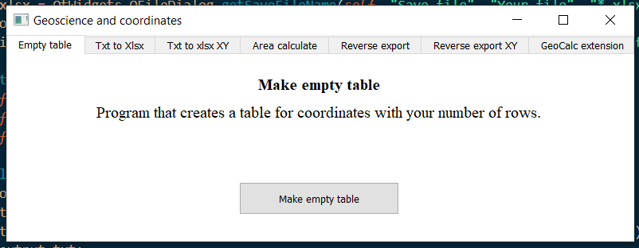
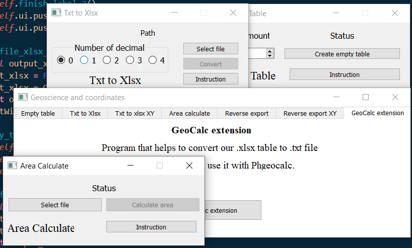

# All in one

Here we have all our program in one 

Using these modules

All modules from previous program

Add some GUI using PyQt5 and QT Designer

[PyQt5](https://pypi.org/project/PyQt5/) - link to pypi.

---

All we need is launch this program and select the tab we need

1. Open program



2. Select the tab you need and launch a program:




------

If you need - you can replace English to Russian use comments in source

```python
worksheet.write('A' + str(data_shape + 1), 'Amount', write_format_square)                      # Amount value - Сумма
worksheet.write('D' + str(data_shape + 1), ('=SUM(D2:' + str(dd) + ')'), write_format_sum)     # Formula value
worksheet.write('E' + str(data_shape + 1), ('=SUM(E2:' + str(ee) + ')'), write_format_sum)     # Formula value
worksheet.write('A' + str(data_shape + 2), 'S (Ha)', write_format_square)                      # Hectare label - S (Га)
```