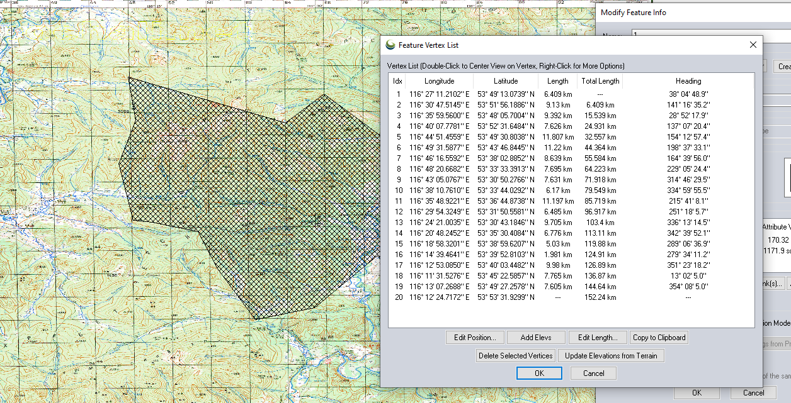
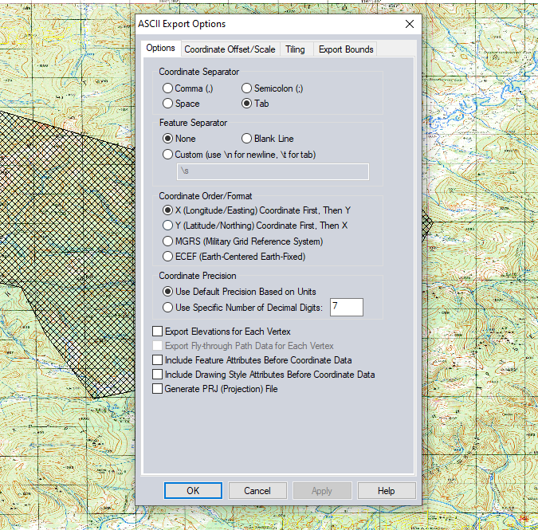
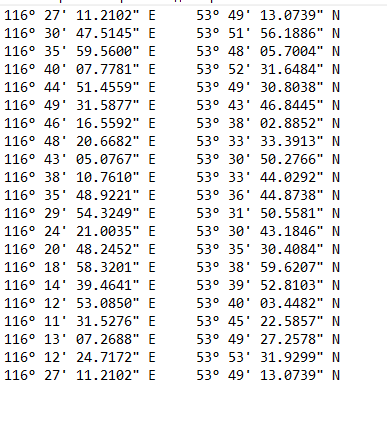
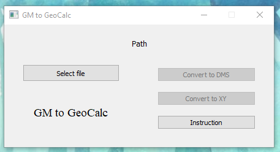
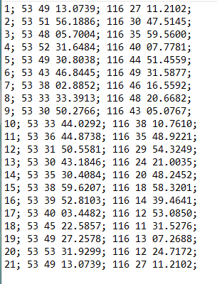
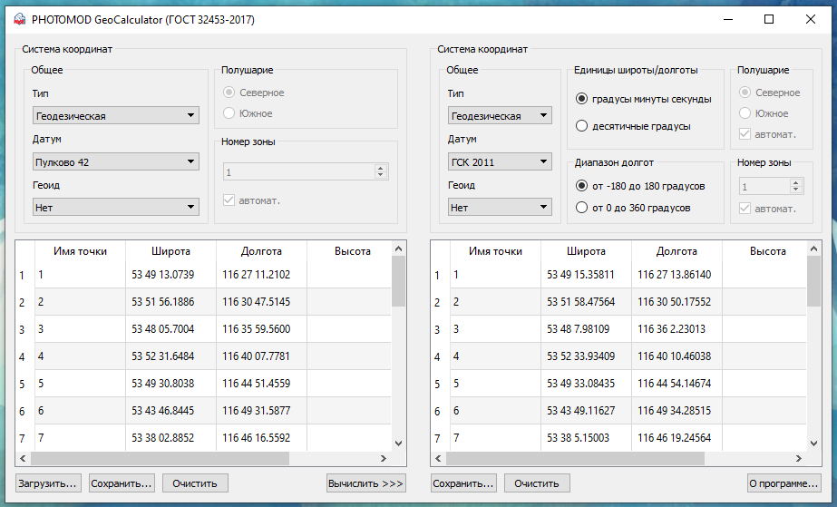

# GM to GeoCalc

Here we make a txt file for PhGeoCalc

[Pandas](https://pypi.org/project/pandas/) - link to pypi.

Add some GUI using PyQt5 and QT Designer

[PyQt5](https://pypi.org/project/PyQt5/) - link to pypi.

---

At first this script was originally for [Global Mapper](https://www.bluemarblegeo.com/global-mapper/) export file, but if you want - you can create your own .txt with data. Lets see.

1. Take the area for export:

2. Export vector/lidar as .txt use this options (example):

3. This is Global Mapper export (example).

4. Run the program we have an interface.

* At first select file
* Choose "Degrees Minutes Seconds" or "XY"
* Select path and name of new .xlsx file

5. And here we have a result (example).

6. Now we can import this file to PhGeoCalc

* Here we can convert coordinates to other projection

It can be useful when you need convert coordinates to other projection and continue work with other program
