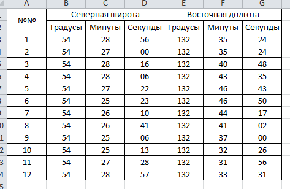
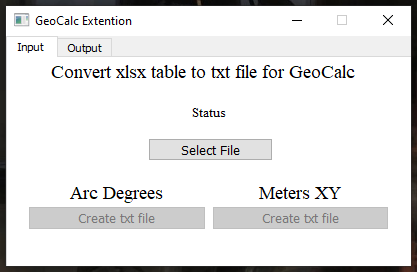
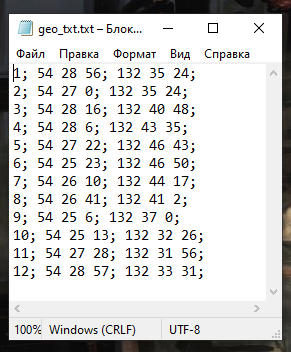
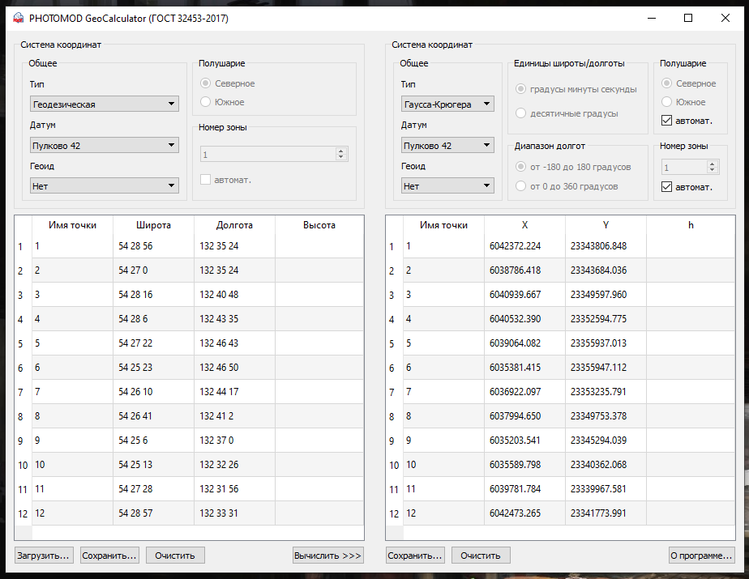
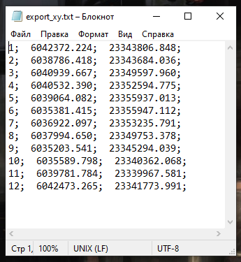
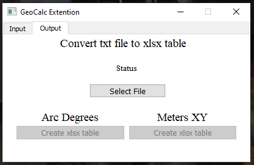
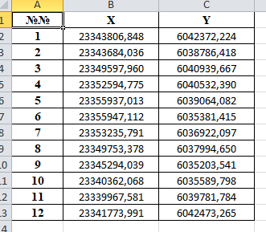

# GeoCalc extension

Here we make a GeoCalc extension to work with [Phgeocalc](https://racurs.ru/program-products/photomod-geocalculator/)

Using these modules

[Openpyxl](https://pypi.org/project/openpyxl/) - link to pypi.

[XlsxWriter](https://pypi.org/project/XlsxWriter/) - link to pypi.

[Pandas](https://pypi.org/project/pandas/) - link to pypi.

[Regex](https://pypi.org/project/regex/) - link to pypi.

Add some GUI using PyQt5 and QT Designer

[PyQt5](https://pypi.org/project/PyQt5/) - link to pypi.

---

Use this script we can convert our .xlsx table to .txt file and back again then use it with [Phgeocalc](https://racurs.ru/program-products/photomod-geocalculator/).

1. Take a .xlsx table with coordinate for convert:



* At first select file



* Then click "Create txt file" button use right format "Arc Degrees or Meters XY"

* Choose path and name of new .txt file
* result of "Export file"



2. Use  [Phgeocalc](https://racurs.ru/program-products/photomod-geocalculator/) open our .txt file



3. Select the right projection.

4. Push "Convert button" and save new .txt file



5. Now we can use our program "Output" tab



6. Select our new .txt file and select right projection

7. Here we have a result



* It can be useful when you already have a .xlsx table and don't want to rewrite all coordinates by yourself

* Change projection

* Copy this table to Word (doc or docx) file or AutoCAD dwg file

* Use [Reverse export](https://github.com/Branhellward/Geoscience-and-coordinates) for import new table to [Global Mapper](https://www.bluemarblegeo.com/global-mapper/)


------

If you need - you can replace English to Russian use comments in source

```python
export_reverse_file = False
export_reverse_file = QtWidgets.QFileDialog.getSaveFileName(self, "Save file", "Your file", "*.txt")[0]	# Сохранить
if not export_reverse_file:
	QtWidgets.QMessageBox.about(self, 'Warning', 'Need to select the name and path of the file!')	# Выбор файла
```


