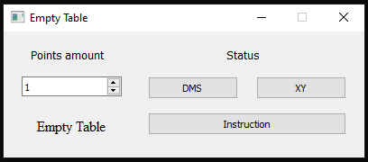
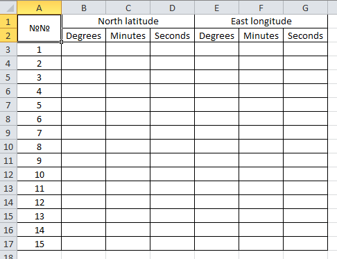

# Empty table

Here we make an empty table for a coordinates

Using a module for creating Excel XLSX files

[XlsxWriter](https://pypi.org/project/XlsxWriter/) - link to pypi.

Add some GUI using PyQt5 and QT Designer

[PyQt5](https://pypi.org/project/PyQt5/) - link to pypi.

---

After run we have an interface:



Input 15 (example)

Click button "Create empty table" and select the name and path of the file

Then you have a "your_name".xlsx file with a full table you want:



It can help you to save some time in future

------

If you need - you can replace English to Russian use comments in source

```python
worksheet.merge_range('A1:A2', '№№', merge_format)
worksheet.merge_range('B1:D1', 'North Latitude', merge_format)   # 'Северная Широта'
worksheet.merge_range('E1:G1', 'East Longitude', merge_format)   # 'Восточная Долгота'
```


