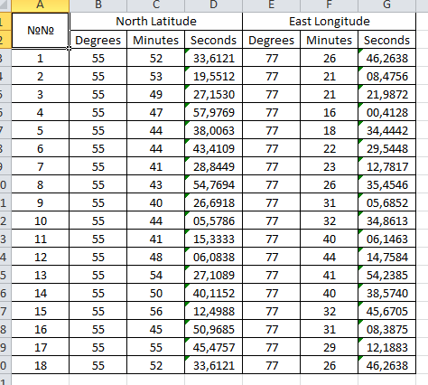
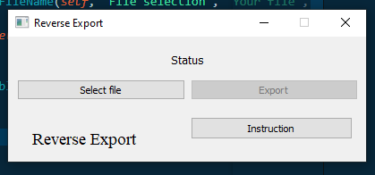
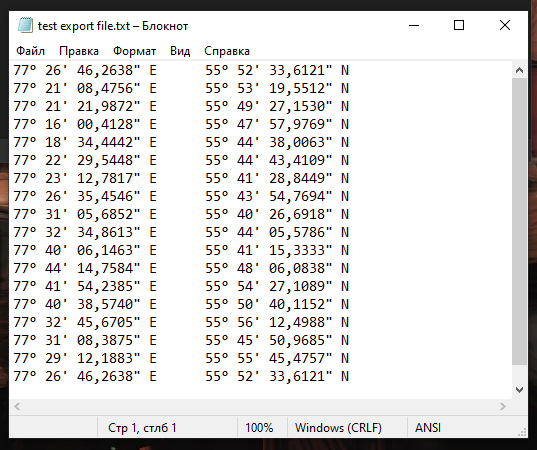
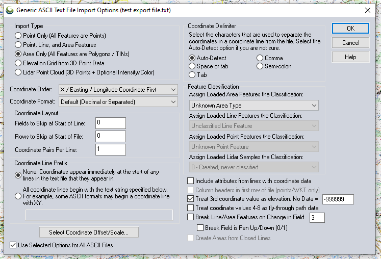
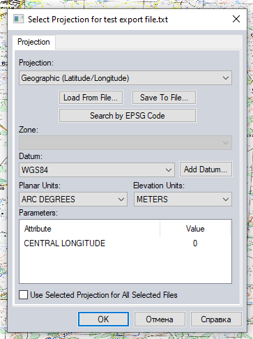
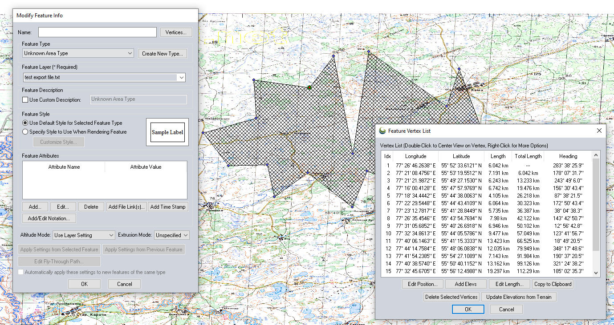

# Reverse export

Here we make a reverse export of our .xlsx table

Using these modules

[Openpyxl](https://pypi.org/project/openpyxl/) - link to pypi.

Add some GUI using PyQt5 and QT Designer

[PyQt5](https://pypi.org/project/PyQt5/) - link to pypi.

---

Use this script we can convert our .xlsx table to .txt file, then import it to [Global Mapper](https://www.bluemarblegeo.com/global-mapper/).

1. Take a .xlsx table with coordinate for convert:



* At first select file

  

* Then click "Export" button

* Choose path and name of new .txt file
* result of "Reverse Export"


2. Use  [Global Mapper](https://www.bluemarblegeo.com/global-mapper/) open our .txt file



3. Select the right projection.



4. Here we have a result (example).



It can be useful when you already have a .xlsx table and don't want to rewrite all coordinates by yourself.

------

If you need - you can replace English to Russian use comments in source

```python
export_reverse_file = False
export_reverse_file = QtWidgets.QFileDialog.getSaveFileName(self, "Save file", "Your file", "*.txt")[0]	# Сохранить
if not export_reverse_file:
	QtWidgets.QMessageBox.about(self, 'Warning', 'Need to select the name and path of the file!')	# Выбор файла
```


