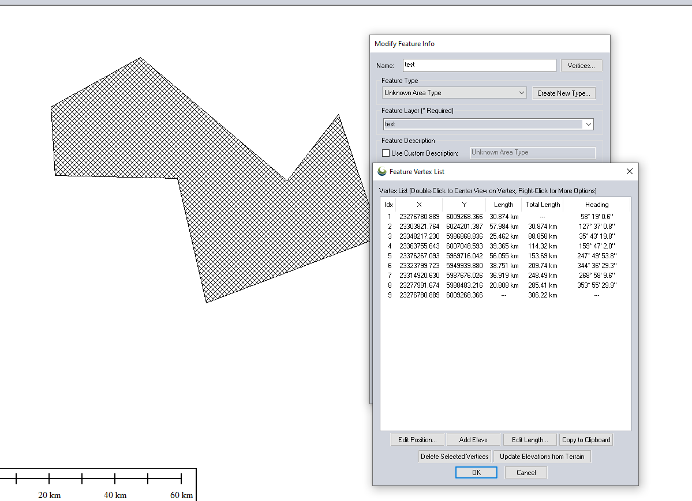
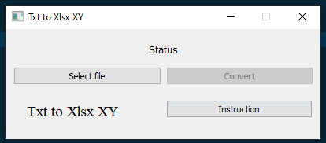
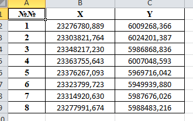

# Txt to Xlsx XY

Here we make an empty table for export coordinates

Using a module for creating Excel XLSX files

[XlsxWriter](https://pypi.org/project/XlsxWriter/) - link to pypi.

[Pandas](https://pypi.org/project/pandas/) - link to pypi.

[Regex](https://pypi.org/project/regex/) - link to pypi.

Add some GUI using PyQt5 and QT Designer

[PyQt5](https://pypi.org/project/PyQt5/) - link to pypi.

---

At first this script was originally for [Global Mapper](https://www.bluemarblegeo.com/global-mapper/) export file, but if you want - you can create your own .txt with data. Lets see.

1. Take the area for export:

2. Export vector/lidar as .txt use this options (example):

3. This is Global Mapper export (example).

4. Run the program we have an interface.

* At first select file
* Then click "Convert" button
* Choose path and name of new .xlsx file

5. And here we have a result (example).

It can be useful when you need copy this table to Word (doc or docx) file or AutoCAD dwg file

